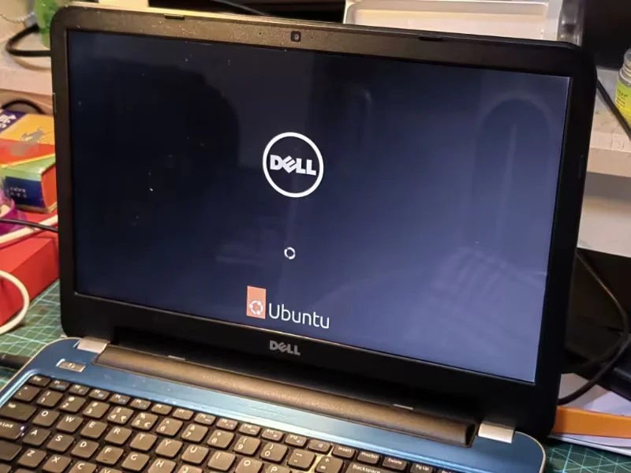
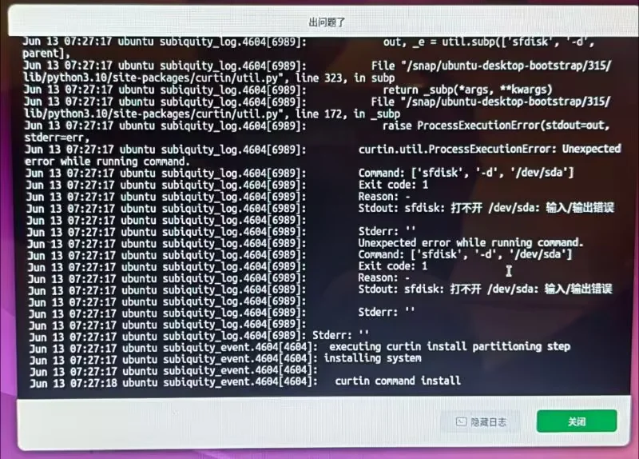
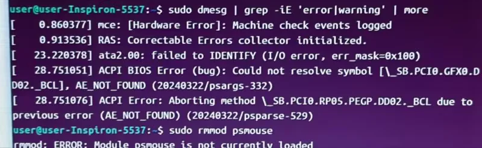
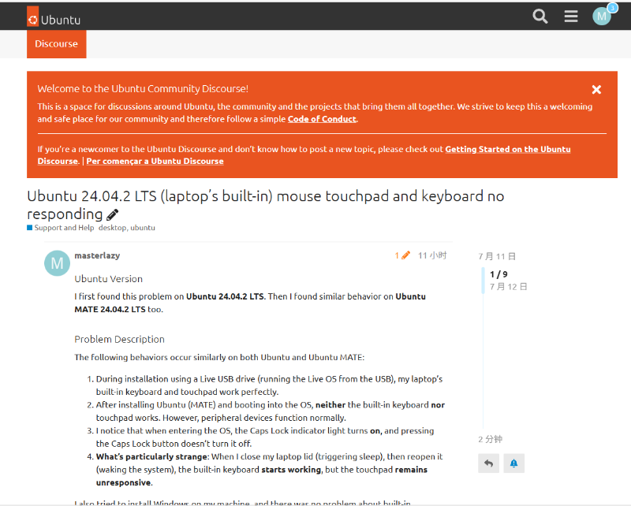

# 上古笔记本电脑维修记

又名：《废铁转生之再战三年》

</Img>

最近两天一直在致力于修一台 12 年前发售的上古笔记本电脑，它可以开机，但是无法引导进入 OS。（注：为了叙述简洁，没有按照时间顺序来写。）

{/* truncate */}

## Part I

由于古老性，我严重忧虑它没法运行 Windows 10，所以决定安装 Ubuntu 24.04.2 LTS。然而尝试安装了好几次，都卡在把镜像写入硬盘这一步（File I/O Error、BrokenPipe）。尝试了各种安装选项，重新给硬盘简历分区表和重新格式化，问题依然存在。怀疑是硬盘问题，就测试写入。发现可以写入，很奇怪，又试了一次，还是卡在相同的步骤。

于是乎，把硬盘拆下来连到另外一台电脑上检测，果然发现了四个柱面有坏道，还是分散在三处的。

</Img>

## Part II

换了一块硬盘，成功安装了 Ubuntu。然而我不甘心，还是想用之前的旧硬盘来装 OS。用 DiskGenius 来创建分区，恰避开了损坏的柱面。然而，Ubuntu 24.04.2 LTS 没法安装，后来试了 Ubuntu 22.04.5，也不行。Windows 10 倒是可以装，不过装完过了不久自己卡死了。遂放弃，可能这块盘比较邪吧。

盲猜：系统所在分区前面就是坏道所在，引导的时候可能要一路读过去，遇到坏道就卡了。

## Part III

Ubuntu 很好，但是有一个严重的问题，笔记本的键盘和触控板都失灵了。试着装了 Windows 10，却没有这个问题。而且在运行 Ubuntu Live OS 期间也没有这个问题。尝试询问 Deepseek，但是它没能给出完全解决的方法（不过辅助分析了问题）。后来试了半天，发现惊天的现象：把笔记本合上再打开键盘就能用了，但是触控板不能。还有一个观察就是键盘失灵期间 Capslock一直是亮着的。

检查内核启动日志，果然发现 Error，原来似乎是 ACPI 尝试对键盘调用“显卡亮度控制方法”

（_BCL，Deepseek 告诉我的），出错了。但是没能找到解决方法。想了想，或许试着升级一下主板 BIOS 固件可以解决问题。

</Img>

## Part IV

到 DELL 官网一搜，吓一跳，发现 BIOS 固件紧急更新。可是更新程序是 .exe 格式的，Linux 就别想跑了。可是为了这个装 Windows 太麻烦了。于是先后尝试用 PE OS，MS-DOS 安装，均失败。最后咬咬牙，装了 Windows 10，然而打开程序说，要求插入电池。然而电池已经坏了，所以 BIOS 固件是别想更新了。

## Part V

于是尝试了 Ubuntu MATE 24.04.2 LTS，这个发行版据说比较适合旧设备，然而装了不但没解决问题，UI 也不是很好看。又尝试 Ubuntu 22.04.5 LTS，不过问题仍在。看来是要妥协了，装了 Windows 10，不得不说真的是一步一卡，等到我傻。同时在 discourse.ubuntu.com 上创建了一个帖子寻求社区帮助。本来我是对此不抱什么希望的，要么没人理，要么解决周期很长。不过出乎意料，创建一小时后就有人回复了。四小时前，有人给出了尝试方案。我试了下，真的有用，太神了。实际上就是往内核启动参数里面加 i8042.reset。

</Img>

（以下内容追加于同月13日）

## Part VI

还有一点小问题：无线网卡损坏、空格键坏了。

空格键坏了，难修，但是可以把右 Alt 键（反正一年也用不到几次）映射成空格，曲线救国。

网络方面，买了一块无线网卡（就是一个小USB），不过淘宝上买大多数都只提供 Windows 驱动，少部分说支持 Linux，但实际上要求你自己编译，相当于“理论可行，剩下的你自己来吧”，而且不提供技术支持（只是留一个 CSDN 和 GitHub 链接）。于是把网卡接到 Windows 电脑上安装驱动，发现芯片型号是 AIC8800D80，顺藤摸瓜，找到了有人把腾达提供的驱动源码修改了一下上传到了 GitHub 的仓库。clone 之后拷贝 rules 和 firmware，然后 make，然后 sudo make install，就成功安装了驱动。