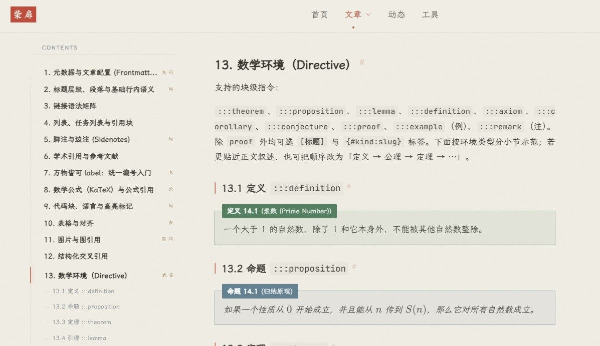

# 2026 年的一点博客心得

转眼这个赛博笔记本都上线一年多了。说是赛博笔记本，其实作用差不多就是一个博客吧。从今天开始，我把 Docusaurus 的 blog 打开了，真的变成半个博客了。

想想还真是特别。

## 为什么写博客

理由很简单，就像之前我写在博客园的那样：

> - 有的东西看完就忘了，得记笔记。
> - 觉得好像没找到关于某事物很好的介绍文字，遂自己写。

现在看来，还有一点，就是在信息海洋中提炼一点精华。虽然这点精华估计都要被喂给 AI 了吧，但是确实是自己的一点小天地，这里的文章都是可靠、精心编写的。

{/* truncate */}

> 还有一点，就是当时 OI 要写题解，但是洛谷题解区一般都关了，洛谷博客也不是很好看，所以打算把题解之类的当博客写。

所以就开始有写博客的念头了。起初用的就是博客园。它老牌，可靠，有很多成熟的美化方案，而且免费使用，少量广告。不用自建站，国内访问快。

那为什么后来又不用了呢？

原因有两点。其一，虽然确实有非常成熟的美化方案（awescnb，现在改名 [tona](https://github.com/guangzan/tona) 了，我还 fork 过这个仓库来着），但是嘛，总感觉不是特别对我的审美。~~博客不好看怎么会有动力写呢。~~ 当时有过一个念头，就是自己打造一个好看的皮肤。后来放弃了，不是我的菜。

</Img>

其二，网络上有很多神奇的爬虫，整天爬爬爬，我文章刚发出来几十秒就被爬了，比如：[程序杂谈：概述-编程学习网](http://www.jsqmd.com/news/4789/)、[C++ GUI 选型记-编程学习网](http://www.jsqmd.com/news/6598/)，我真服了。

所以才自己建站，有了 mNotebook。

## 一路走来的 mNotebook

我的博客用的是 Docusaurus[^1]，这个选型好像比较少见。 Docusaurus 似乎比较常用于做技术文档之类的吧。选 Docusaurus 是因为开发这个的公司是 Facebook 母公司，比较靠谱，感觉会长期支持。

初看 Docusaurus，外观是不太好的。但是 Docusaurus 基于 React，React 就很有可玩性了。参看 [关于 mNotebook](/docs/jot/mnotebook)，有很大的自定义空间。所以才有了你现在看到的 mNotebook 的样子，我觉得是非常养眼的。当时我刚刚学会给 Docusaurus 写自定义组件时，开心坏了，~~整了一大堆花里胡哨的组件~~。后来稍微收敛一点了。毕竟笔记 / 博客这东西，还是内容大于形式的。况且用了一堆 Markdown 之外的东西，如果未来要迁移什么的，很麻烦啊。

---

我曾经很想把我的笔记都数字化，但是一直都不是很有动力。

一方面是做数字笔记虽然美观、好编辑，但是输入比较麻烦。像这样纯文本的文章还好，如果要穿插插图、公式之类（比如数学笔记），就很麻烦了。纸上做笔记更直接，更快。

另一方面，就是一直盯着屏幕眼睛会很累，也就是数字笔记不太适合长时间阅读。不过这个问题我现在解决了，受 Martial Design 3 启发，我现在把背景从纯白改成了这样的极浅色，会好一点。（还有一点，就是文章的宽度不要太宽，否则眼睛扫视会比较累。这些都是细节，初建站都没有注意到。）

我之前还有一个毛病，就是笔记嵌套很多，比如：计算机科学 / 原生技术栈 / .NET 生态 / WPF，太深了！现在我决定最多嵌套三层，且把分类放粗一点，比如把“原生技术栈”和“Web 技术栈”合并成“软件工程”。如果以后笔记确实很多，再分开。

---

总之，现在的 mNotebook，越来越接近我心目中的理想样子了。

但还是有点缺陷的。比如我现在编辑笔记，就要先启动 `yarn start`，然后创建 `.md`，在 Typora 中打开，再挂个浏览器，实时看效果。这么看来，要敲笔记还是比较繁琐。

## 遇到的优秀博客

网上冲浪，看到的有些博客确实很惊艳，浅浅收录到下面，可供日后借鉴。

> 网络很大，每个人的博客感觉都像互联网的角落，可遇不可求啊。比如读到这些文字的，估计只有我自己吧。

- [This Cute World](https://thiscute.world/)：有深度、有思考的博文。
  
- [柴扉 | CHAI](https://chai.ac.cn/)：很精致的博客，看出来博主也很用心地打造了博客系统。不过好像目前内容不多。
  </Img>

- [博客 — AcoFork / AF](https://www.acofork.com/posts/)：二叉树树的博客。页面很美观，不知道为何有点明日方舟的味道。

  </Img>

## 写在后面

从今天开始，我也在这个小站上写博客了。相比于那些放在 `docs/` 下的笔记，博客可能没有那么精致，也不用那么多花里胡哨的组件了。

我还搬了一些之前写的，现在看来算作博客的文章到这里，让这里看起来稍微热闹一些。

 

[^1]: 笔者打了这个词无数遍，~~做梦都能拼对~~