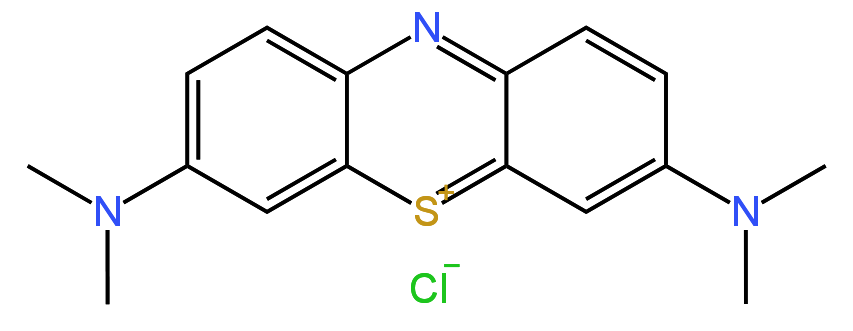
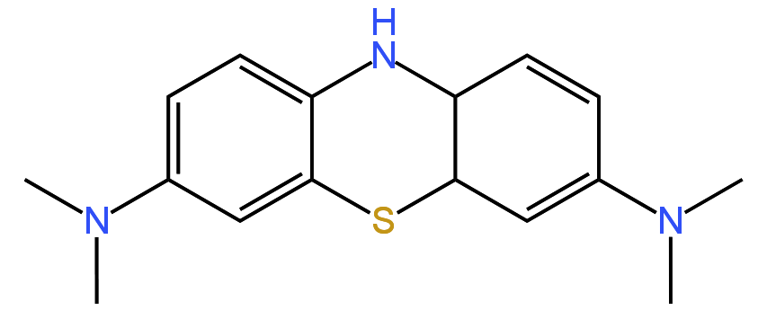

# 蓝瓶子实验

经典的化学摇摇乐实验，也许是很多人在科学课 / 化学课上看到的第一个实验。

## 材料

- 亚甲基蓝（$\text{C}_{16}\text{H}_{18}\text{N}_3\text{ClS}$）
- 葡萄糖
- 氢氧化钠

## 实验步骤

1. 取 $0.4\text{g}$ 氢氧化钠，用 $20\text{mL}$ 蒸馏水配成溶液。
2. 取 $5.0\text{g}$ 葡萄糖，用 $100\text{mL}$ 蒸馏水配成溶液。
3. 将以上两种溶液混合。
4. 用玻璃棒蘸取少量亚甲基蓝，伸入溶液搅拌均匀。

:::info
亚甲基蓝染色能力极强，在水中溶解度很小，非常少量的亚甲基蓝就足以完成本实验。\
实验时小心不要把亚甲基蓝洒到手上、桌子上，比较难清理。
:::

## 现象 & 原理

- 静置时，成品中的葡萄糖将亚甲基蓝还原（还原态亚甲基蓝），呈无色。
- 震荡成品，空气中的氧气溶于溶液中并氧化亚甲基蓝，呈蓝色。

    
        

        亚甲基蓝
    </Img>
    
        

        还原态亚甲基蓝
    </Img>

