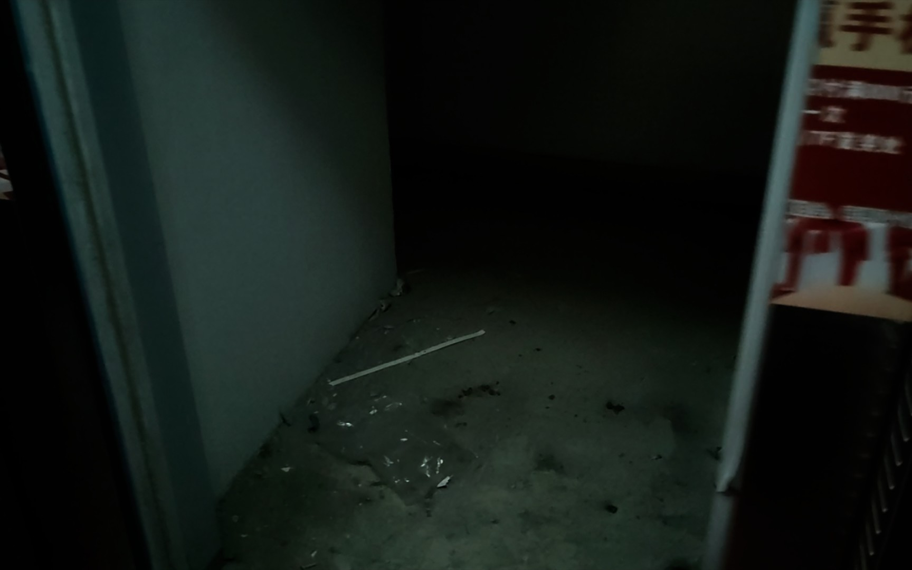

# 电梯夹层

:::info

本文是面向现实的笔记，不是都市怪谈。笔者没有到访过「电梯夹层」，鉴于网上可以找到视频案例记录，笔者强烈认为本文陈述的情况是存在的。

:::

:::danger

**永远不要尝试进入「电梯夹层」。** 

:::

这里的「电梯夹层」指的不是电梯位于两层之间的情况，而是一些建筑内废弃或封锁、不对外开放的楼层（或区域）。其通常无法通过楼梯进入，只能借助电梯并通过特殊的方法进入。电梯经过「电梯夹层」时，楼层面板和电梯内的面板上都不会显示其编号，感觉就像「不存在的楼层」。

[BV1F5411C7jT](https://www.bilibili.com/video/BV1F5411C7jT)
</Img>

## 形成

「电梯夹层」一般会出现在写字楼、商场或者下商铺、上住宅的建筑中。普通公寓楼一般不会存在「电梯夹层」。

以下是可能形成「电梯夹层」的情况：

1. 建筑有多部电梯，某层业主不希望某部电梯停靠在此楼层，于是用墙或铁门封锁了电梯门。
2. 商场内废弃的楼层。

所谓的「电梯夹层」在电梯建造时就是普通的平层，因而安装有厅门、平层感应器，所以使电梯停靠在「电梯夹层」是可能的。不过多数「电梯夹层」的外呼（即厅门旁的电梯按钮）无法使用，或者干脆拆除了外呼。

## 预防

走出电梯时不要看手机，注意观察到达楼层的情况。如果发现电梯门后是废弃的楼层、有墙或铁门阻挡，或者和你想到达的楼层不符，不要走出电梯。

只要不走出电梯，你大概率是安全的。按下电梯内其他的按钮，等待电梯将你运送至安全的楼层即可。如果电梯不能正常运行，留在电梯里，按下报警按钮，等待救援。

如果出于某些原因，你想要观察电梯外的情况，请注意留一只脚在电梯里并持续按下开门按钮，避免电梯门关闭。**这点非常重要。** 如果你发现外呼不能使用，一定不要离开电梯。

## 进入

:::warning

**你已经被警告过了。**

:::

对于大多数电梯，按下电梯内的按钮是没有办法进入「电梯夹层」的；这些按钮只会带你去正常楼层。有少部分建筑的通讯面板按钮会保留「电梯夹层」的按钮。

「电梯夹层」位于正常楼层之间。可以通过观察电梯运行至每层的时间来确定「电梯夹层」的位置。例如「电梯夹层」位于 L1 和 L2 之间，以下是可能的进入步骤：

1. 从 L1 层进入电梯。
2. 按下 L2 层按钮，待电梯启动后立即取消。除非有人召唤，电梯会尝试在就近的平层停靠。
3. 电梯停稳后，按下开门键（可能需要重复按下或长按）。

电梯门打开，出现在你面前的是一个废弃的楼层，或者一堵墙或铁门，说明电梯成功停靠在了「电梯夹层」。

## 被困

如果你此时走出电梯，并让电梯门在身后关上，那么你就被困在「电梯夹层」了。

此层很可能没有基础的设施，包括照明、通风、逃生通道等。「电梯夹层」的厅门旁的外呼一般是失效的，没有办法召唤电梯。还有一些「电梯夹层」的外呼直接被拆除，看不到按钮。所以，电梯门一旦关闭，再无从此处进入的可能。

## 逃生

如果手机有信号，可以报警求助。但对于一些建筑，「电梯夹层」内甚至没有网络信号。以下是可能的逃生方法：

1. 寻找楼梯（应急通道）。不过通常不会允许从楼梯进入「电梯夹层」，所以此层的楼梯很有可能被封死，无法进入或到达其他楼层。
2. 寻找求救按钮之类的设施。
3. 尝试大声呼喊、电梯经过时猛击电梯门，引起外部人员注意。
4. 想办法开窗或创造通风条件，避免缺氧或吸入灰尘而致病。
