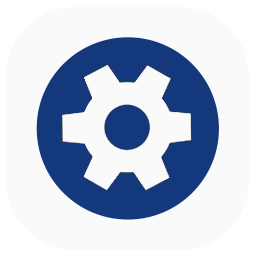
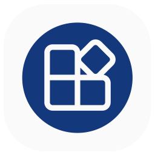
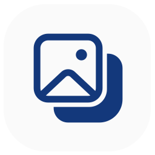

# 项目 Logo

笔者参与的一些项目的 logo（强迫症狂喜）。大致按照使用的技术为这些图标分类；同类中按登场时间排序。

- 尺寸：`256px * 256px`
- 背景色：<ColorDot color='#fafafa' />`#fafafa`

## .NET (C#)

前景色：<ColorDot color='#13387b' />`#13387b`

[SWTools](https://github.com/King-zzk/Steam-Workshops-Tools-SWTools)
</Img>

[MdViewer](https://github.com/masterLazy/MdViewer)
</Img>

[RePKG.Neo](https://github.com/masterLazy/RePKG.Neo)
</Img>

[LazyWpf](https://github.com/masterLazy/LazyWpf)
</Img>

[ImageTools](https://github.com/masterLazy/ImageTools)
</Img>

