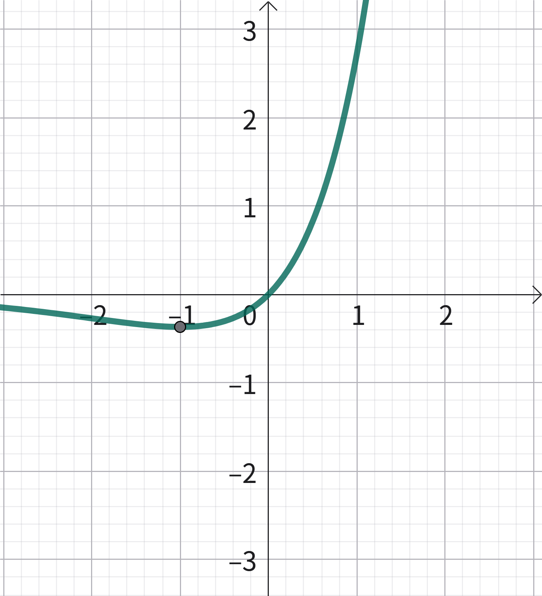
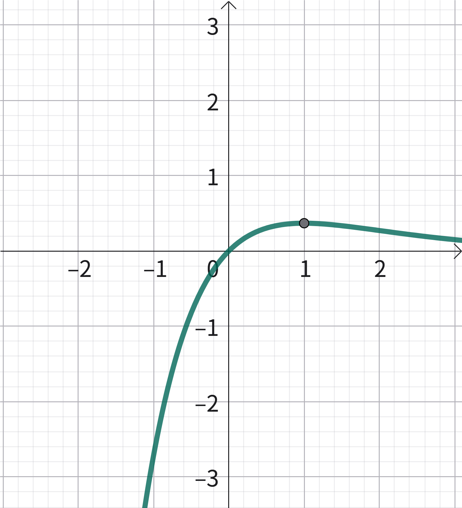
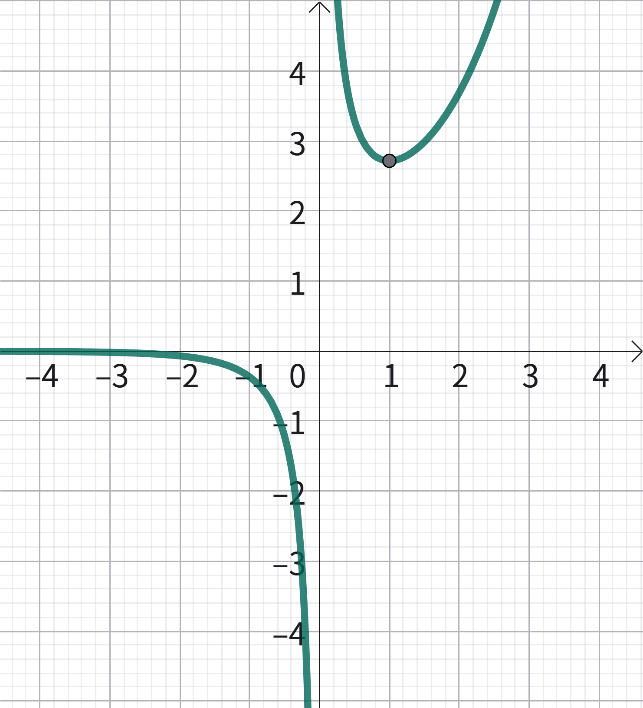
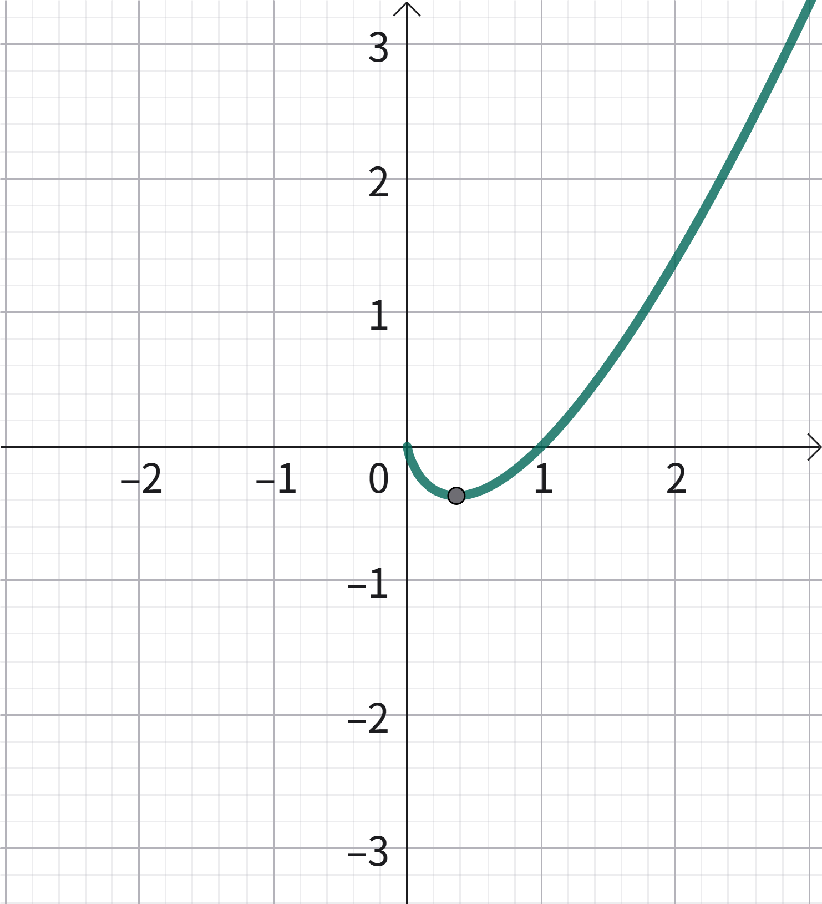
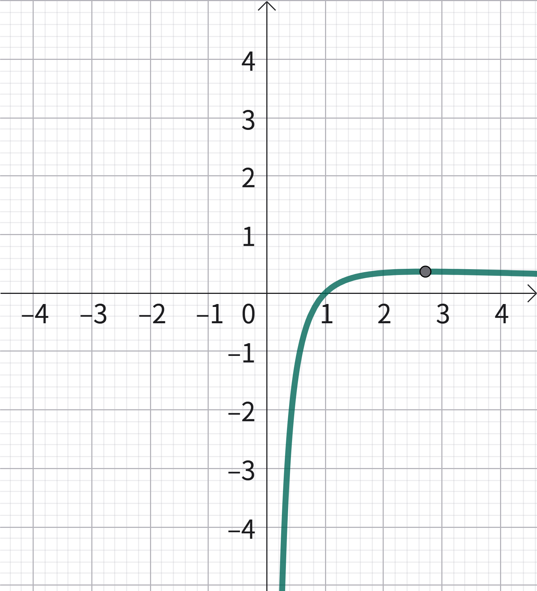
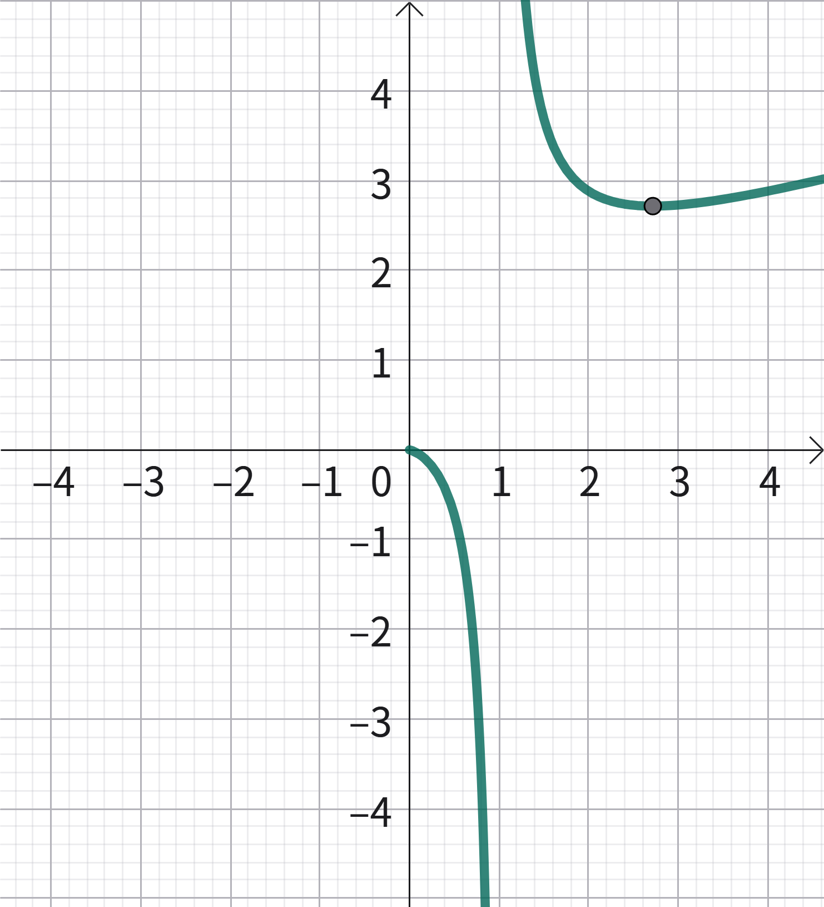
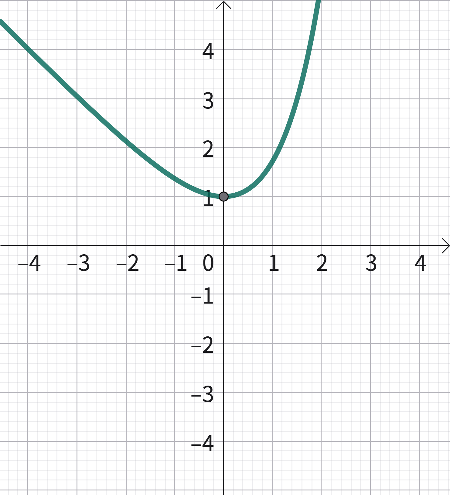
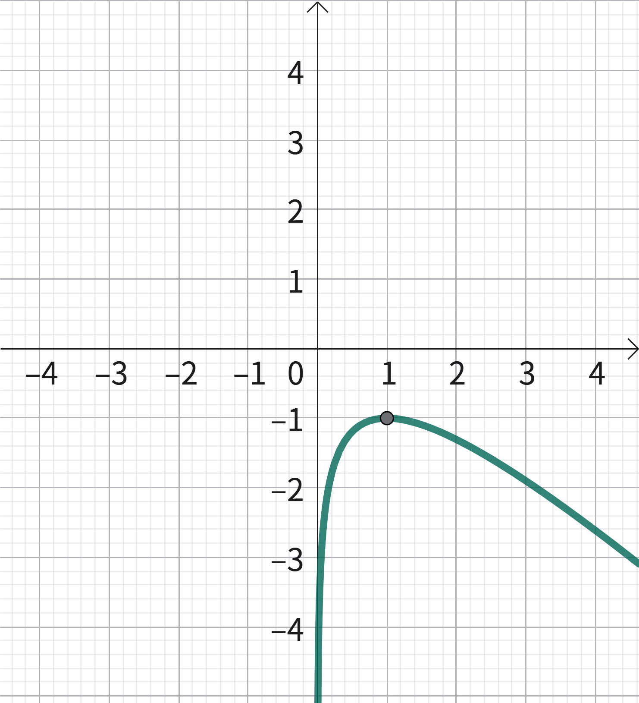
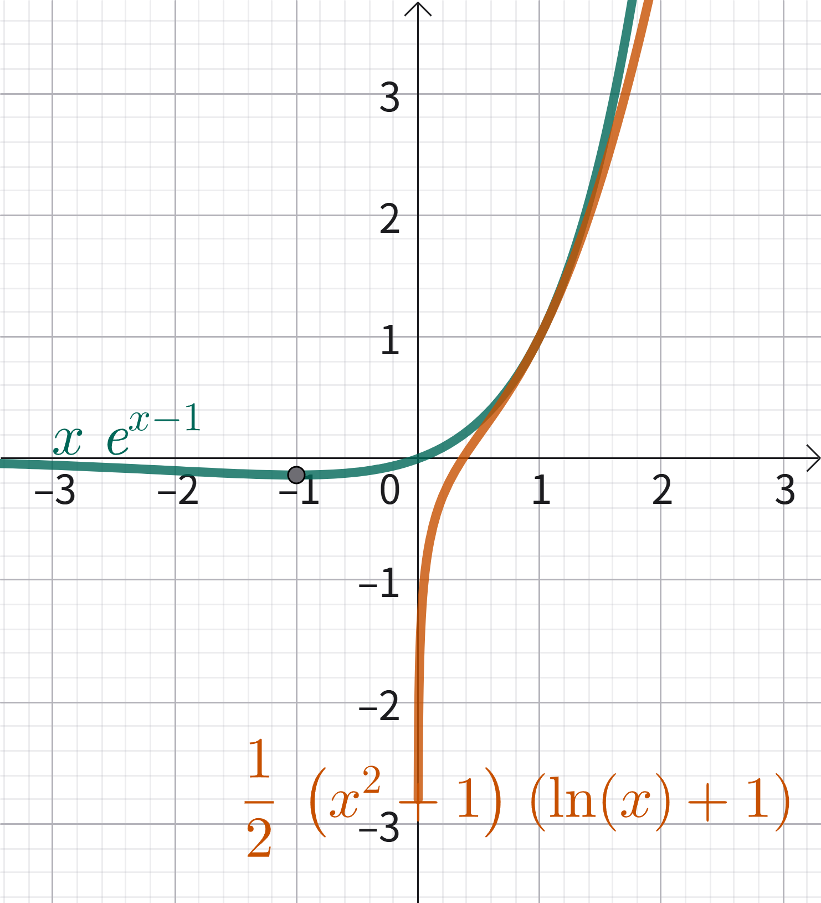
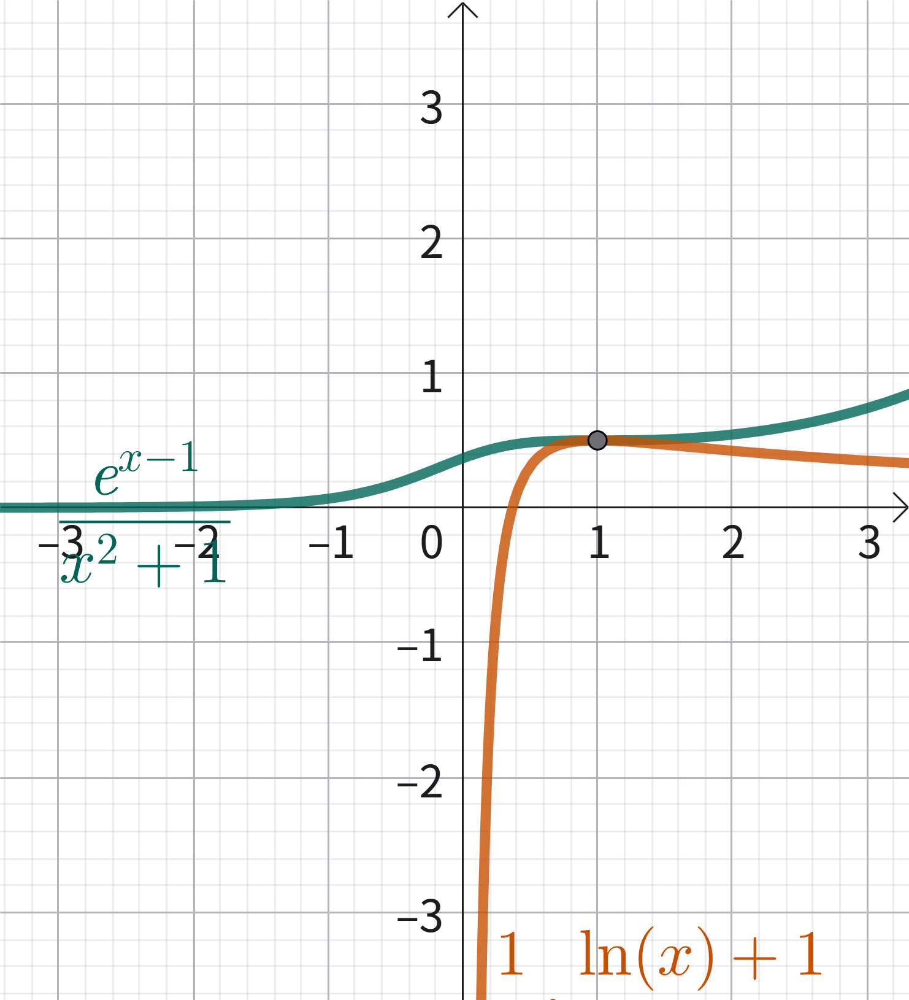

# 黄金函数×凹凸反转

所谓**黄金函数**，指的是一些**有极值**的“母函数”。记忆这些函数，可以为解题提供思路指引。如果发现题目里有这些函数就偷着乐吧。做题时，只需要把函数凑成黄金函数即可求得极值（**化归/模型思想**）。

而所谓**凹凸反转法**，指的是证明不等式时，构造两个凹凸性相反的函数，然后通过比较极值来间接证明不等式成立。有点类似一种放缩技巧。这样的好处是避免了整体研究的复杂，相当于把证明任务分成了两个子任务，每个都容易解决。

通常我们会构造两个凹凸性相反的**黄金函数**，因而黄金函数和凹凸反转是紧密关联的。

## 黄金函数

下面给出了八个黄金函数的图像和极值点，都是和指对有关的。

记忆方法：已知是黄金函数的情况下，取 $x\to+\infin$，若 $f(x)\to+\infin$ 说明有最小值；若 $f(x)\to-\infin$ 则说明有最大值。如果把式中的 $x$ 代换成任意一次多项式，得到的图像都是类似的。

	 
	 

	$y=xe^x\Rightarrow(-1,-\dfrac1e)$ 
	</Img>
	
	 
	
	$y=\dfrac{x}{e^x}\Rightarrow(1,\dfrac1e)$
	</Img>
	 
	 
	
	$y=\dfrac{e^x}{x}\Rightarrow(1,e)$ 
	</Img>
	 
	 
	
	$y=x\ln x\Rightarrow(\dfrac1e,-\dfrac1e)$
	</Img>
	
	 
	
	$y=\dfrac{\ln x}{x}\Rightarrow(e,\dfrac1e)$
	</Img>
	
	 
	
	$y=\dfrac{x}{\ln x}\Rightarrow(e,e)$
	</Img>
	
	 
	
	$y=e^x-x\Rightarrow(0,1)$
	</Img>
	 
	 
	
	$y=\ln x-x\Rightarrow(1,-1)$
	</Img>

## 凹凸反转法

凹凸反转法的核心即构造两个凹凸性相反的黄金函数，通过分别求两个黄金函数的极值，间接证明不等式成立。常用处理技巧有同乘/除 $x$，$e^x\ln x$等。

### 例 1

证明：$e^x\ln x>1-\dfrac{2e^{x-1}}{x}$ 恒成立。

即证
$$
x\ln x+\dfrac2e>\dfrac x{e^x}
$$
拆成两个黄金函数
$$
x\ln x+\dfrac1e>\dfrac x{e^x}-\dfrac1e
$$
根据上面的图像可得
$$
x\ln x\ge-\dfrac1e,\;\dfrac x{e^x}\le\dfrac1e
$$
这两个不等式不能同时取等，因而得证 $x\ln x+\dfrac2e>\dfrac x{e^x}$。证毕。

### 例 2

证明：$\dfrac{e^{x-1}}{\ln x+1}>\dfrac12(x+\dfrac1x)$ 恒成立。

即证
$$
e^{x-1}>\dfrac12(x+\dfrac1x)(\ln x+1)
$$
即证
$$
xe^{x-1}>\dfrac12(x^2+1)(\ln x+1)
$$
不等式两边大约是 $xe^x>x\ln x$ 的形式，然而这两个函数同凹，不行。

整理得
$$
\dfrac{e^{x-1}}{x^2+1}>\dfrac12\dfrac{(\ln x+1)}x
$$
现在不等式两边大约是 $\dfrac ex>\dfrac{\ln x}x$，凹凸性恰相反，分别求得极值即可，下略。证毕。

下面借助函数图像来加深一下对凹凸反转法的印象：

 

构造前
</Img>
 

构造后
</Img>

### 小结

通过例 2 可以发现，如果把黄金函数中的 $x$ 带换成其他多项式，得到的图像虽然大不相同，但是极值和凹凸性结论大致相同。黄金函数给我们提供了很好的判断极值和凹凸性的工具。

### 习题

使用凹凸反转法证明：$x+\ln x-2e^{x-1}\le-1$ 恒成立。

