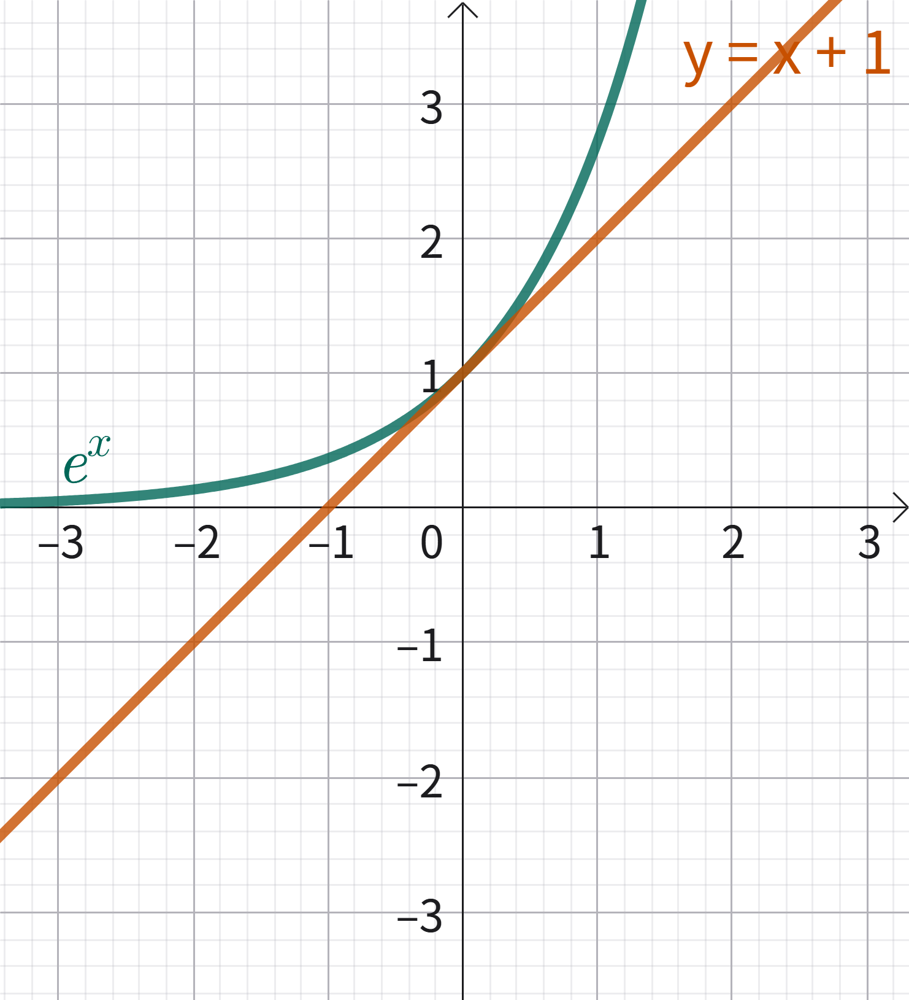
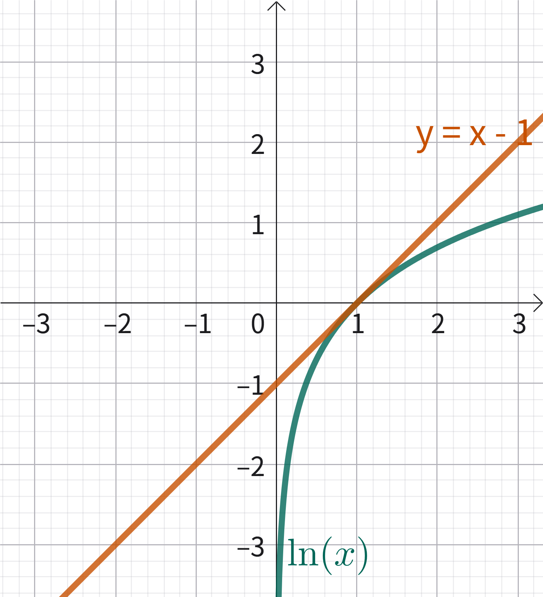
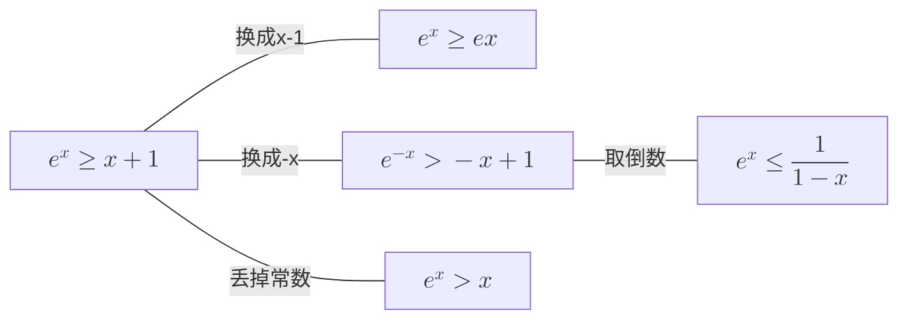
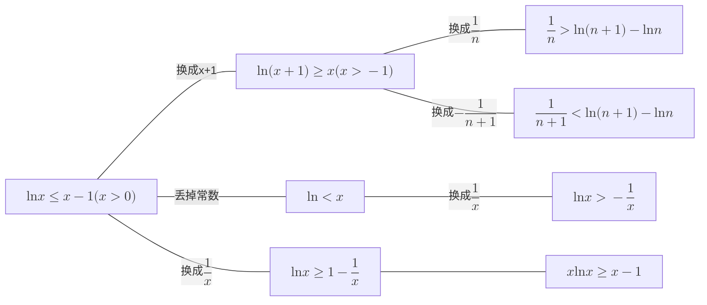

# 切线放缩

这是一些**非常常用**的不等式，因放缩后的函数与放缩前的函数相切得名。其变体非常非常多。

## 核心

整个切线放缩体系建立在下面两个核心不等式之上，它们可以通过朴素的整体法证明。**务必要记得**这两个不等式。
- $e^x\ge x+1$
- $\ln x \le x-1$

</Img>

</Img>

这两个不等式也是可以互推的，例如已知 $e^x\ge x+1$，只需要把 $x$ 换成 $\ln x$，即可得到 $\ln x \le x-1$。

从这两个不等式出发，可以得到数不清的衍生结论，下面只给出了几个我觉得值得一记的结论。

## 衍生结论

由上面可以得到一个**重要的推论**，证明求和类不等式常用：

$$
\ln(n+1)\lt\sum\dfrac1n\le\ln n+1
$$

当且仅当 $n=1$ 时等号成立。

    ### 习题

    设数列 $\{a_n\}$ 满足 $a_n=\dfrac1n$，其前缀和记为 $S_n$，证明：$S_{n+1}-\ln(\dfrac1{2a_n}+1)<\dfrac32$ 恒成立。                    

> 提示：此题数学归纳法无效，考虑用上面的结论。

