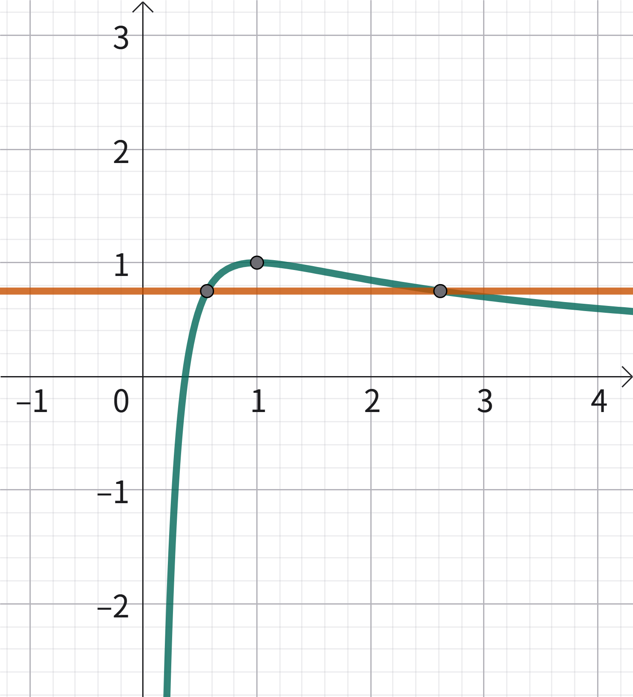

# 双变量问题

这是一类要证明两个变量之和/积满足给定不等式的题目。方针是两个字：**消元**。即转换为我们熟悉的单变量问题。

这样说可能有点抽象，所以我们先看一道超级经典的例题：

### 例 1

已知 $f(x)=\dfrac{\ln x+1}x$，$x_1,x_2$ 分别是 $f(x)=m$ 的两根（$0<x_1<x_2$），证明：$x_1^2+x_2^2\gt2$。

这是一个单峰的函数，图像画出来是这样的：

图 1

</Img>

### 预处理

例 1 要证 $x_1^2+x_2^2$，然而这个结构带有平方，不好凑出。遇到这种情况，需要先改写命题（即预处理）。

要证 $x_1^2+x_2^2\gt2$，根据基本不等式，等价于证明 $x_1+x_2\gt2$ 或 $x_1x_2\gt1$。那么具体选择证明哪个呢？这要视实际情况决定，和题目及我们所用的方法有关。无措时可以逐一尝试，看看哪个比较好做。

## 极值点偏移

解决双变量问题有多种方法，极值点偏移仅是其中一种。也可以说极值点偏移是双变量问题中的一类。

观察图 1，可以发现当 $m=f_{max}$ 即取到极值时，$x_1=x_2=1$，不等式恰好取等。而 $m\lt f_{max}$ 时，$x_2$ 增长的速度要比 $x_1$ 减小的速度更大，因而不等式左侧会更大。我们称这种情况为**右偏**，反之则叫**左偏**。

像这样，**不等式在极值点处恰取等**的问题，称为**极值点偏移**问题，或者说可以用极值点偏移的方法来做。

:::tip

也就是说，如果极值点处不等式不能取等（或不能成立），需要先构造出一个 $F(x)$，使得不等式在 $F(x)$ 的极值点取等，才能采取此类方法解题。

:::

极值点偏移有多种做法，下面逐项介绍。

### 对称化构造

对称化构造的核心是将关于 $x$ 的不等关系转换为 $f(x)$ 的不等关系（同时消元），借助 $f(x)$ 的结构完成证明。这是一种相对**简易**的方法，处理一些复杂结构时可能会比较吃力。当不等式右边**非对称**时，优先考虑此方法。下面用例 1 解释此方法。

> 为了叙述简洁，我们直接选择证明 $x_1x_2>1$。读者可以自行尝试用同样的方法证明 $x_1+x_2>2$，这会比较困难。

由图 1，我们可以知道 $x_1,x_2$ 分居对称轴 $x=1$ 两侧，即 $x_1<1<x_2$。这就意味着 $x_1,x_2$ 所属的区间上 $f(x)$ 的增减性是不同的。我们需要把**不等式两边**处理到**同一单调区间**内。

要证 $x_1+x_2>2$，即证
$$
x_2\gt\dfrac1{x_1}
$$
于是有 $x_2\gt1$，$\dfrac1x_1\gt1$，它俩在同一单调区间了。由 $f(x)$ 在 $(1,+\infin)$ 上单调递减，即证
$$
f(x_2)<f(\dfrac1{x_1})
$$
由 $f(x_2)=f(x_1)$，即证（消元，**最有灵魂的一步**）
$$
f(x_1)<f(\dfrac1{x_1})
$$
令 $g(x)=f(x)-f(\dfrac1x)$，即证 $x\in(0,1)$ 时，$g(x)<0$ 恒成立。

我们不急着把 $g(x)$ 展开，而是直接求导（注意链式法则）
$$
g'(x)=f'(x)+\dfrac1{x^2}f'(\dfrac1x)=\ln x(-\dfrac1{x^2}+1)
$$
$g'(x)$ 是单调递减的，只需令 $g'(x)=0$ 即可证明 $g(x)<0$，下略。证毕。

### 习题 1

已知 $f(x)=x-\ln x$，若实数 $x_1,x_2$ 满足 $f(x_1)=f(x_2)=m\,(x_1\not=x_2)$，证明：$x_1+x_2\gt m+1$。

> 提示：此题属于上面所说的“不等式右边非对称”的情况，应该优先考虑使用对称化构造；解题中可能会用到“分离恒正项”的技巧。

### 比值换元

这是极值点偏移的**通用方法**，不过也不能覆盖所有题目（反例如上面的习题 1）。下面仍以例 1 讲解。

第一步：假设两根的比值。设 $\dfrac{x_1}{x_2}=t$，则 $t\in(0,1)$。

第二步：列出等值方程
$$
\left\{
\begin{aligned}
f(x_1)=\dfrac{1+\ln x_1}{x_1}=m\\
f(x_2)=\dfrac{1+\ln x_2}{x_2}=m\\
\end{aligned}
\right.
$$
第三步：利用方程凑出 $\dfrac{x_1}{x_2}$ 的结构，用 $t$ 反解出 $x_1,x_2$（或其指对形式）。此处只需将两个方程作比，整理得
$$
\dfrac{x_1}{x_2}=\dfrac{\ln x_1+1}{\ln x_2+1}=t
$$
代入 $x_1=tx_2$，解得 $\ln x_2=\dfrac{\ln t-t+1}{t-1}$，则 $\ln x_1=\ln tx_2=\dfrac{t\ln t-t+1}{t-1}$。

到这一步，消元完成，已经很明朗了：我们选择证明 $x_1x_2\gt1$，即 $\ln x_1+\ln x_2\gt0$。设

$$
h(t)=\ln x_1+\ln x_2=\dfrac{(t+1)\ln t-t+1}{t-1}
$$
则
$$
h'(t)=\dfrac1t+\ln t-1,\,h''(x)=\dfrac{t-1}{t^2}
$$

则 $h'(t)$ 在 $(0,1)$ 单调递减。于是可以证明 $h(t)\gt0$，$x_1x_2\gt1$。证毕。

### 对数均值不等式

对数均值不等式：$\sqrt{ab}\lt\dfrac{a-b}{\ln a-\ln b}\lt\dfrac{a+b}2$，$a,b\gt0$。这组不等式可以“嵌”在不等式链中。

简单的极值点偏移问题可以直接用对数均值不等式证明，因而这是一种**狭隘**的方法。证明有些复杂的不等式的过程中可能会需要使用对数均值不等式来简化。

> 师云：对数均值不等式的精度太差了。

要证明对数均值不等式，同样需要比值换元的思想，以证明右边的不等式为例，先化成
$$
\dfrac{\dfrac ab-1}{\ln\dfrac ab}\lt\dfrac{\dfrac ab+1}2
$$
然后令 $t=\dfrac ab$，完成证明。

---

例 1 中，列出等值方程后，可以整理得
$$
\dfrac1m=\dfrac{x_1-x_2}{\ln x_1-\ln x_2}\lt\sqrt{\dfrac{x_1^2+x_2^2}{2}}
$$
得 $x_1^2+x_2^2\gt\dfrac2{m^2}$。结合图 1 可知 $m\in(0,1)$，则 $\dfrac2{m^2}\in(2,+\infin)$，故 $x_1^2+x_2^2\gt\dfrac2{m^2}\gt2$，证毕。