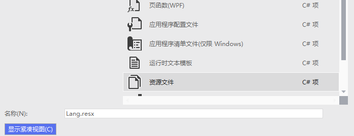
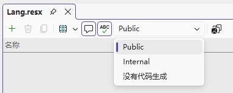
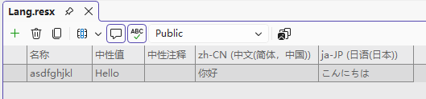
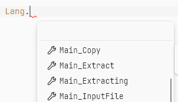
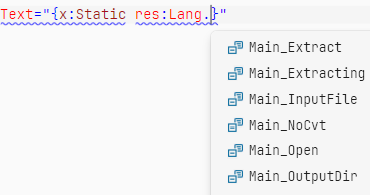
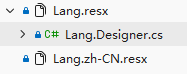

# C# 国际化

:::note

之前我写过一次这个笔记，但不慎遗失了。重写就写得简单些吧。

:::

先认识两个单词：

- 国际化：**i**nternationalizatio**n**，简称 **i18n**，18 指的是单词首尾之间有 18 个字母；
- 本地化：**L**ocalizatio**n**，简称 **L10n**。

举个例子，我们写一个程序，界面是中文的，现在让它也能支持英文，这个过程就叫**国际化**。而一个程序被启动时，根据运行环境选取合适的显示语言，这个过程就叫**本地化**。

所以我们国际化要做的就是让 UI 支持不同的语言。

## 语言代码

常见的语言代码有下面这些，大概是以“语言-使用地区”命名的。请注意前两个字母是小写，后两个是大写，后面的步骤最好要保证大小写正确。

- `zh-CN` 中文（简体）
- `zh-TW` 中文（繁体）
- `en-US` 英语（美国）
- `en-GB` 英语（英国）

## 国际化步骤

国际化的大致思路如下：

1. 把程序中界面显示的文本字符串（要翻译的那些）从代码中剥离出来；
2. 单独创建资源文件（`.resx`）容纳这些字符串，并且每个语言创建专属 `.resx`；
3. 程序构建时会把这些 `.resx` 构建成单独的 `.dll`，程序启动时加载语言对应的 `.dll` 即可完成本地化。

### 创建资源文件

一般来说，先新建一个 `res/` 目录，专门放资源文件。然后右键目录，像下面这样添加一个 `Lang.resx`。




</Img>

我们来讲讲 `.dll` 加载的逻辑。假如我创建了 `Lang.resx` 和 `Lang.xx-XX.resx` 两个资源文件，

1. 假如我的系统语言设置为 `xx-XX`，则优先加载 `Lang.xx-XX`（优先加载语言匹配的项）；
2. 假如我的系统语言设置不是 `xx-XX`，则 `Lang` 作为“默认”加载。

稍微想一下，我们不妨在 `Lang.resx` 中写英文，即把英文作为默认语言，再单独为 `zh-CN` 做一个 `.resx`，这样效果会比较好。




</Img>

创建好后第一件事**务必**先把上面这个 Internal 改成 **Public**。




</Img>

IDE 会像上面这样自动关联前缀相同的 `.resx` 文件。于是我们就能愉快地开始国际化了。需要注意的是“名称”就是我们在代码中调用的时候所用的“**键**”。

### 在 `.cs` 中调用

如果你创建的是 `Lang.resx`，那么直接用 `Lang.asdfghjkl` 这样就能访问到了，非常方便。

### 在 `.xaml` 中调用

首先添加命名空间引用。如果你用了 `res` 之外的路径来放资源，改成对应的路径就好了。

```xml
xmlns:loc="clr-namespace:[项目名].res"
```

然后像这样引用：

```xml
<... Text="{x:Static Lang.asdfghjkl}" />
```

---

国际化大成功！无论是 C# 还是 Xaml 都有补全提示，体验非常舒适。你也许会发现 IDE 自动生成了一个 `Lang.Designer.cs` 文件，而这正是 `.resx` 文件实现的原理。

<div class='group'>




</Img>




</Img>




</Img>
</div>

程序构建目录下也会多一些如 `zh-CN/` 的目录，里面放的就是语言特定的 `.dll`。