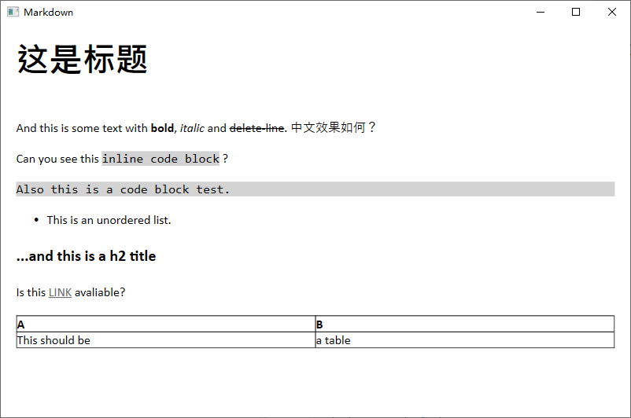
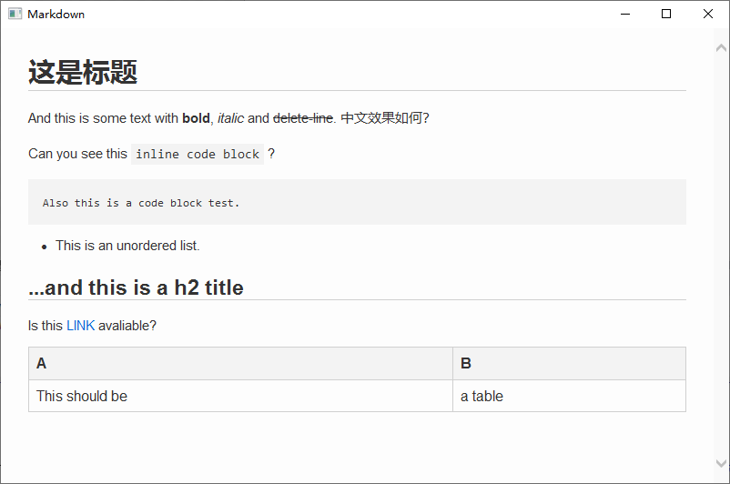
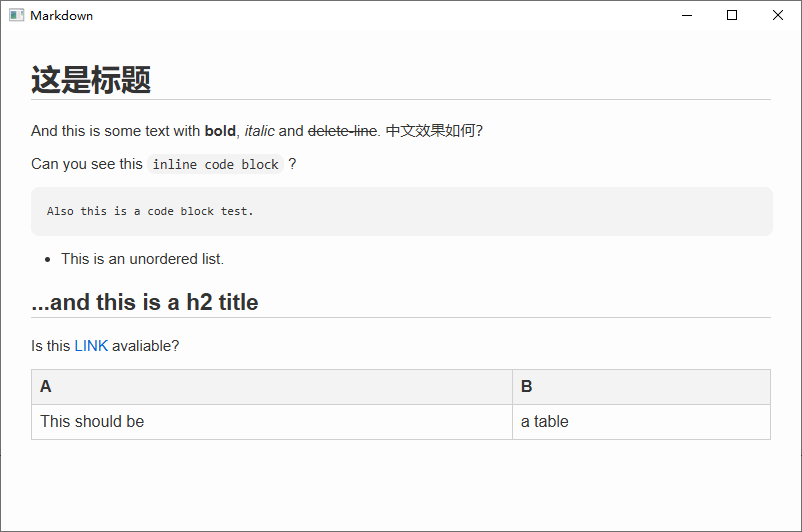

# WPF 的 Markdown 渲染方案

最近笔者参与的项目有在 WPF 应用程序中渲染 Markdown 的需求。网上没找到太系统性的总结，故笔者在这里记录一下研究成果。大致有下面几种思路：

1. **基于 Web 渲染**：先用 CommonMark 之类的 Markdown 解释器把 `.md` 解释成 HTML，再以网页的形式显示出来。这种方式需要自行编写 `.css` 来为 Markdown 设置样式，但正因此灵活性更高，允许控制显示细节。实测这种方式的显示效果较好。
2. **基于 Xaml**：把 Markdown 解释成 `FlowDocument` 对象，然后直接用 WPF 组件渲染。实测感觉显示的效果很一般。

### 先说结论

笔者认为 Web 渲染的效果更好：[传送门](#web-渲染)

- 推荐小型程序使用 **Markdig + WebBrowser**。视觉效果优于基于 Xaml 的解释器（略有缺陷），只需额外的 148 KB 发布体积。
- 如果你不在乎发布体积，用 **WebViewer2**。这会带来额外的 >10 MB 发布体积，但是会有最好的视觉效果。

下面就介绍一下使用的 NuGet 第三方库以及实现细节。

## Markdown 解释器

下面这个网站可以很方便地对比不同的 Markdown 解释器的渲染效果：

- [babelmark3 | Compare Markdown Implementations](https://babelmark.github.io/)

以下是一个 Markdown 例子（后文统一使用此例子来测试效果）：

````markdown
# 这是标题

And this is some text with **bold**, *italic* and ~~delete-line~~. 中文效果如何？

Can you see this `inline code block` ?

```
Also this is a code block test.
```

- This is an unordered list.

## ...and this is a h2 title

Is this [LINK](https://www.example.com) avaliable?

| A | B |
|---|---|
|This should be|a table|
````

下面是这个例子的 HTML 解释，你可以从中看到不同的 Markdown 元素是怎么解释成 HTML 的：

<details>
<summary>一种可能的解释（HTML）</summary>

```html
<h1>这是标题</h1>
<p>
    And this is some text with <strong>bold
    </strong>, <em>italic
    </em> and <del>delete-line
    </del>. 中文效果如何？
</p>
<p>
    Can you see this <code>inline code block</code> ?
</p>
<pre>
  <code>Also this is a code block test.</code>
</pre>
<ul>
    <li>This is an unordered list.</li>
</ul>
<h2>...and this is a h2 title</h2>
<p>
    Is this <a href="https://www.example.com">LINK</a> avaliable?
</p>
<table>
    <thead>
        <tr>
            <th>A</th>
            <th>B</th>
        </tr>
    </thead>
    <tbody>
        <tr>
            <td>This should be</td>
            <td>a table</td>
        </tr>
    </tbody>
</table>
```
</details>

### CommonMark.NET

CommonMark 实际上是一套 Markdown 规范，而 [CommonMark.NET](https://github.com/Knagis/CommonMark.NET/) 则是基于该规范的 .NET 解释器。其支持大部分的 Markdown 语法，除了：

- 表格（如 ` |---|---|` 式的管道表）
- 删除线（形如 `~~something~~` 的语法）

CommonMark 速度快且轻量级，`CommonMark.dll` 只有 148 KB。如果不需要渲染表格，笔者非常推荐这个解释器。以下是一个例子：

```csharp
var result = CommonMark.CommonMarkConverter.Convert("Hello, **world**!");
```

### Markdig

在 NuGet 上搜索“Markdown”，下载数量最多的是 [Markdig](https://github.com/xoofx/markdig)。Markdig 同样基于 CommonMark 规范。它重用了 CommonMark.NET 的一些代码，并添加了很多扩展语法支持。`Markdig.dll` 有 397 KB。下面这个例子是最简单的使用方法（不带扩展）：

```csharp
var html = Markdown.ToHtml("Hello, **world**!");
```

开启扩展的例子：

```csharp
var pipeline = new MarkdownPipelineBuilder()
    .UseAdvancedExtensions()  // 启用大多数扩展
    .Build();
var html = Markdown.ToHtml("Hello, **world**!", pipeline);
```

### Markdig.Wpf

[Markdig.Wpf](https://github.com/Kryptos-FR/markdig.wpf) 是一个 Markdig 的拓展库，其提供了一个 `<MarkdownViewer>`，供直接显示 Markdown 文档。这个库是基于 Xaml 的，最终会通过 `FlowDocument` 在 WPF 中呈现。笔者写这篇笔记时，这个项目于 2024 年 **archived** 了，慎用。Github 上没有太多的使用指南。有一篇教程可供参考：[Markdig.Wpf显示图片、导航栏和链接跳转-CSDN博客](https://blog.csdn.net/qq_48906261/article/details/149754533)。这里简单介绍一下怎么用：

1. 首先在 `<Windows>` 中添加命名空间：

    ```xml
    xmlns:md="clr-namespace:Markdig.Wpf;assembly=Markdig.Wpf"
    ```

1. 插入标签（建议一定要设置尺寸，下同）：

    ```xml
    <md:MarkdownViewer Width="800" Height="500" x:Name="MdViewer"/>
    ```

2. 在窗口加载时设置 Markdown：

    ```csharp
    MdViewer.Markdown = "Hello, **world**!";
    ```

效果如下，感觉很一般：

<div className='group'>
    
        

        Markdig.Wpf
    </Img>
</div>

### Neo.Markdig.Xaml

[Neo.Markdig.Xaml](https://github.com/neolithos/NeoMarkdigXaml) 是一个 Markdig 的拓展库，提供了一个把 Markdown 文档转换成 `FlowDocument` 的方法。与用法如下：

1. 插入标签：

   ```xml
   <FlowDocumentScrollViewer Width="800" Height="500" x:Name="FlowDocumentViewer"/>
   ```

2. 在窗口加载时加载 Markdown：

   ```csharp
   var markdown = "Hello, **world**!";
   FlowDocumentViewer.Document = MarkdownXaml.ToFlowDocument(markdown,
       new MarkdownPipelineBuilder()
       .UseXamlSupportedExtensions()
       .Build()
   );
   ```
笔者感觉 Neo.Markdig.Xaml 的视觉效果和 Markdig.Wpf 非常相似，因而这里就不放效果了。

## Web 渲染

把 Markdown 解释成 HTML 后，我们便可以在 WPF 应用程序中以网页形式显示出来。（推荐使用前文提到的 Markdig 并开启拓展）

### WebBrowser

WPF 内置了 `WebBrowser` 以提供网页显示功能。优点是启动快、无需额外的 `.dll`。不过其用的是很旧的 IE 内核，CSS 支持很有限。如果不是非常追求美观（以及复杂功能），完全可以使用 `WebBrowser`。比较明显的缺陷是没有抗锯齿和无序列表不美观。

1. 准备一个 CSS，用于设置网页样式。具体来说可以做成**嵌入的资源**，运行时通过反射获取资源。以下是一个例子，效果还不错：

   ```css
   body{font-family:Arial,sans-serif;color:#333;background-color:#fdfdfd;margin:5px 30px;font-size:15px}h1,h2,h3,h4,h5,h6{margin-top:1em;font-weight:600;line-height:1.25}h1{font-size:2em;border-bottom:1px solid #d0d0d0}h2{font-size:1.5em;border-bottom:1px solid #d0d0d0}h3{font-size:1.25em}h4,h4,h5{font-size:1em}p{margin-bottom:1em}a{color:#0366d6;text-decoration:none}a:hover{text-decoration:underline}ul,ol{margin:0;padding-left:2em;margin-bottom:1em}code{background-color:#f3f3f3;border-radius:8px;font-family:Consolas,sans-serif;font-size:0.9em;padding:0.2em 0.4em}pre{background-color:#f3f3f3;border-radius:8px;font-family:Consolas,sans-serif;font-size:0.9em;line-height:1.45;overflow:auto;padding:16px;margin-bottom:1em;width:calc(100%-30px);word-wrap:break-word}pre code{background:none;padding:0}blockquote{border-left:4px solid #d0d0d0;color:#6a737d;margin:0 0 1em 0;padding:0 1em}hr{background-color:#d0d0d0;border:0;height:1px;margin:24px 0}strong{font-weight:700}em{font-style:italic}table{width:100%;border-collapse:collapse;margin-bottom:1em}th,td{border:1px solid #d0d0d0;padding:8px;text-align:left}th{background-color:#f3f3f3}
   ```

2. 把 CSS 和解释后的 Markdown 组装：

   ```csharp
   var html = $@"<html>
   <head><meta charset=""UTF-8""><style>{css}</style></head>
   <body>{content}</body>
   </html>"; // content 就是 Markdown 解析成的 HTML
   ```

   这里不写 `<!doctype html>` 也是可以的。推荐不写，这样可以和上面的 CSS 配合的很好。

3. 插入标签：

   ```xml
   <WebBrowser Width="800" Height="500" x:Name="WebViewer"/>
   ```

4. 在窗口加载时导航到 HTML：

   ```csharp
   WebViewer.NavigateToString(html);
   // 点击链接时，用默认浏览器打开
   WebViewer.Navigating += (s, e) => {
       e.Cancel = true;
       System.Diagnostics.Process.Start("explorer.exe", e.Uri.ToString());
   };
   ```


效果如下，除了之前说的两点缺陷以外看着都很舒服：

<div className='group'>
    
        

        Markdig（开启拓展）+ WebBrowser
    </Img>
</div>

在 WebBrowser 上右键可以查看页面的 HTML 代码。

### WebView2

WebView2 是微软官方推出的一个 WPF 组件，以 Edge 为内核实现网页功能，因而比内置的 WebBrowser 更强大。缺点是启动较慢（感觉有 500ms），而且需要附加许多文件（见后面描述），而且需要目标计算机上安装 Edge 或 WebView2 runtime（不过 Windows 10+ 好像都内置了 Edge）。使用过程如下（组装过程省略）：

1. 首先在 `<Windows>` 中添加命名空间：

   ```xml
   xmlns:wv2="clr-namespace:Microsoft.Web.WebView2.Wpf;assembly=Microsoft.Web.WebView2.Wpf"
   ```

2. 插入标签：
   ```xml
   <wv2:WebView2 Width="800" Height="500" x:Name="WebViewer"/>
   ```

3. 等待 WebView2 内核加载完成，然后导航到 HTML。我们创建一个异步方法，并在窗口加载时调用：

   ```csharp
   private async void LoadHtml(string html) {
       await WebViewer.EnsureCoreWebView2Async();
       WebViewer.NavigateToString(html);
   }
   ```

:::info

此处没有设置链接行为，点击页面中的链接会直接在 WebViewer2 中打开。

:::

效果如下，笔者认为是视觉上最好的：

<div className='group'>
    
        

        Markdig（开启拓展）+ WebViewer2
    </Img>
</div>

在 WebViewer2 上右键可以使用 Edge 配套的 Dev Tools。这个页面的显示似乎和 Edge 的设置是有关的。比如笔者的 Edge 默认字体是 Noto Sans，此处就是用的 Noto Sans 渲染。

生成目录下还会产生下面的东西：

- 目录 `xxx.exe.WebView2/`，约 9.38 MB。

- 若干 `Microsoft.Web.WebView2.xxx.dll`、`Microsoft.Web.WebView2.xxx.xml`，共 1.46 MB。

总过超过 10 MB，这会使得发布包变大。