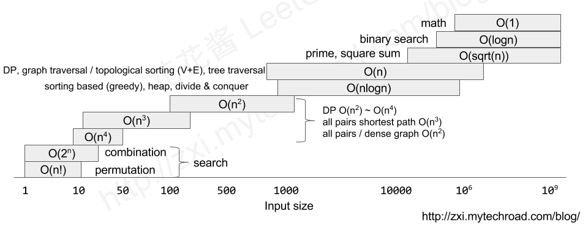

# ⭐ 考前自查

考前 Checklist。

## 个人易错项

- `typedef long long ll;` 计数类题目千万谨慎，答案是否爆 `int`？
- 取模前如果涉及减法，**有没有先加上模数**？
- 线段树 **pushdown** 了吗？
- 循环的迭代变量与上下界**是否对应**？函数的形参和实参**意义匹配**了吗？
- **范围！看清楚了吗？**（值域下界是 $0$ 还是 $1$？）无向图是否开 $2$ 倍边？线段树是否开 $4$ 倍空间？动态开点是否开 $40\times($更新$+$查询$)$？

## 考场操作流程

- 下载所有试题。
- 花 30 min 读完所有题（或前 3 题），并思考做法。开始深入思考之前**务必确保题意已经理解无误**。思考如何优化之前先思考**做法是否正确**。可以在心中大致按难度排序。
- 从最有思路的一题入手。别忘了可以通过**看 Subtask 获取思路指引**。搭建代码框架的时候不要急，以免出现低级编码错误。做题时每隔几分钟提醒自己是否发呆。必要时祭出去 WC 大招。
- 不要放弃部分分。没有头猪也不妨尝试“不可以，总司令”。
- 最后 5 min，停止调试，检查 `freopen()` 之类，并提交代码。

### 0. 下载试题

1. 连接 FTP 服务器，地址形如：`ftp://192.168.xxx.xxx`。
2. 选择所有题目，**右键复制**，导航到主目录，新建一个 `original/` 文件夹，**右键粘贴**。
3. 备份一遍 `original/`，防止手残把题目文件覆盖了。
4. 建议直接在每道题目的子文件夹中创建 `.cpp` 文件。

### 1. 开始编码

在这之前先读完所有题（或前 3 题）。

1. 打开 VS Code，打开 `original/` 文件夹。
2. 导航到题目子文件夹，创建源文件。
3. 写完代码后，按下 <code>ctrl + &#96;</code> 呼出终端窗口。然后可以运行、测试。

### 2. 提交前检查

1. `freopen()` 写了吗？文件名写对了吗（测完样例**文件名**改回来没有）？**逐字符检查。** 正确示例：
    ```cpp
    freopen("bracket.in", "r", stdin); // "r" 和 "w" 千万不能写反！
    freopen("bracket.out", "w", stdout);
    ```
2. `.cpp` 文件名对了吗？题目文件夹名字对了吗？**逐字符检查。**
3. 检查输出语句，调试代码真的删干净了吗？
4. 如果题目有多组测试数据，真的把**所有状态**清空了吗？

### 3. 提交程序

可以阅读桌面上的 **README.pdf**：

1. 每道题目建立一个子文件夹。
2. 子文件夹应当仅包含一个 `.cpp` 文件。

## 速查

### 数据类型

1. `int`（`%d`）最大值：$2^{31}-1\approx10^{9.33}$，数字不大于 $10^9$ 可用。
2. `long long`（`%lld`）最大值：$2^{63}-1\approx10^{18.96}$。
3. `unsigned long long`（`%llu`）最大值：$2^{64}-1\approx10^{19.27}$。**用 `ull` 必检查：过程是否会出现负数？**

### 编译和测试[^1]

可以参考下面的编译参数，或者复制试题给的参数（最好加上 `-Wall`）。
```bash
g++ [源文件.cpp] -O2 -Wall -std=c++14 -static
```
运行程序并测试用时：
```bash
time ./a.out
```

[^1]: - [关于NOI系列活动中编程语言使用限制的补充说明](https://www.noi.cn/xw/2021-09-01/735729.shtml)
    - [NOI 系列赛常见技术问题整理](https://www.luogu.com.cn/article/kgofa37e)

### 时间复杂度[^2]

[^2]: 下面的图和“详细估计”都摘编自 https://zxi.mytechroad.com/blog/sp/input-size-v-s-time-complexity/

评测机在 1s 内约可以完成 $10^8$ 次操作。基于此估计可以估计各时间复杂度能通过的数据规模。

<details>
<summary>详细估计</summary>
- $n<10$：$O(n!)$ - 排列问题
- $n<15$：$O(2^n)$ - 组合问题  
- $n<50$：$O(n^4)$ - DP
- $n<200$：$O(n^3)$ - DP，全对最短路径
- $n<10^3$：$O(n^2)$ - DP，全对问题，稠密图
- $n<10^6$：$O(n \log n)$ - 排序贪心，堆，分治
- $n<10^6$：$O(n)$ - DP，图遍历 / 拓扑排序 $(V+E)$，树遍历
- $n<10^9$：$O(\sqrt{n})$ - 质数判定，平方和问题
- $n<10^9$：$O(\log n)$ - 二分答案
- $n<10^9$：$O(1)$ - 数学公式计算
</details>


<div className='group'>
    
    
    </Img>
</div>

## STL

### 结构体排序

要让自定义的结构体能被 STL 排序，需要重载小于号 `<`：
```cpp title='sort 升序，priority_queue 大根'
struct MyStruct {
    int i;
    bool operator<(const MyStruct& another) {
        return i < another.i;
    }
}
```

### `sort()`

`sort()` 默认是**升序**。

```cpp
sort(begin, end); // 升序
sort(begin, end, greater<int>()); // 降序

sort(a, a + n); // 用 a[0...n-1]
sort(a + 1, a + n + 1); // 用 a[1...n]
sort(v.begin(), v.end());
```

`begin, end` 表示排序的开始和结束范围，即 `[begin, end)`。

### `priority_queue`

`priority_queue` 默认是大根堆。
```cpp
priority_queue<int> q1; // 大根
priority_queue<int, vector<int>, greater<int>()> q2; // 小根
```

## 推荐的参考

- [一文概括所有比赛注意事项，以及同类资料推荐 - LibreOJ](https://loj.ac/d/4782)

---