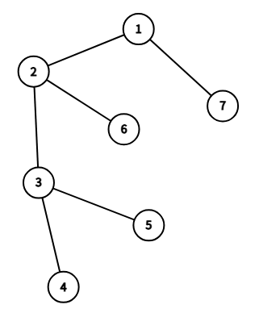

# Tarjan 求 LCA

Tarjan 算法可以在 $\approx O(n+m)$ 的时间复杂度下，**离线地**处理 LCA 查询。

## 过程

`tarjan()` 实际上就是一个 DFS。

- 创建一个并查集。注意这个并查集**只能用路径压缩**来优化，不能用按秩合并。因为我们稍后要手动合并，严格控制节点的上下级关系。

- 从根节点开始 `tarjan()`。对于我们搜索到的每个节点 $u$ ，执行以下操作：
  
  - 递归搜索所有没访问过的、与 $u$ 相连的节点。（先标记 `vis[]` 再进入 `tarjan()`）
  
  - 回溯的时候，我们将正在遍历的子节点 $v$ 的父亲设为 $u$。（`fa[v] = u`）
  
  - 所有子节点搜索完成后，检索涉及 $u$ 的询问。如果存在询问 $\text{LCA}(u,v)$，则检查是否已访问 $v$（`if(vis[v])`）。如果已访问 $v$，记录 $\text{LCA}(u,v)=\text{find}(v)$。

:::info 注意
`vis[]` 是在进入 `tarjan()` 之前设置的，而 `fa[]` 是退出 `tarjan()` 后设置的，有区别！
:::

## 原理分析

    
    
    </Img>

请看上面的树（编号就是 DFS 序），假设我们现在遍历到了 $2$，当我们完成子树的遍历时，开始处理查询：

- $3,4,5,6$ 已经搜索过了，所以它们都在并查集中，且终极祖先都是当前节点 $2$。

- 假如我们现在要处理查询 $\text{LCA}(2,3)$，显然 `vis[3] == true`，所以 $\text{LCA}(2,3)=\text{find}(3)=2$。

再比如，我们什么时候会处理查询 $\text{LCA}(3,6)$ 呢？

- 当我们访问到 $3$ 时，`vis[6] == false`，所以我们不知道 $3$ 的 $\text{LCA}$ 是谁。

- 当我们访问到 $6$ 时，显然 `vis[3] == true`。所以 $\text{LCA}(3,6)=2$。

总结一下 `vis[]` 和并查集的作用：

- `vis[v]` 维护的是：节点 $v$ 是否已被访问过。如果被访问过，说明节点 $v$ 和当前节点 $u$ 的 $\text{LCA}$ 一定已经被搜索了。你可能会问，有可能 $v$ 和当前节点的 $\text{LCA}$ 已经被访问过了，但是 `vis[v] == false` 啊。不要紧，之后我们肯定会进入 $v$ 节点处理查询，这样就转化为第一种情况了。

- 而 $\text{find}(v)$ 维护的是：节点 $v$ 和当前节点 $u$ 的那个 $\text{LCA}$ 是谁。