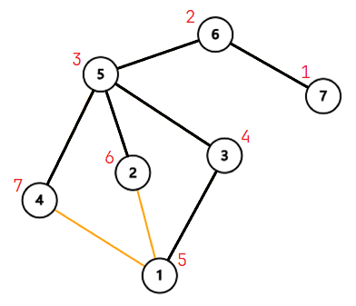
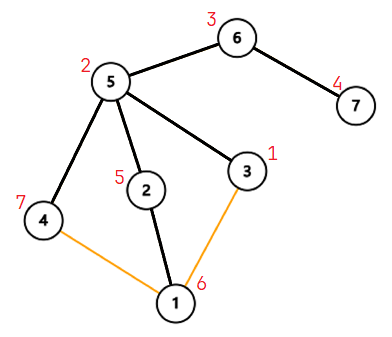

# Tarjan 求割点和割边

Tarjan 可以在 $O(n)$ 的时间复杂度内求出一个**无向图**中的[割点、割边](连通相关问题#割点--割边)。

## 求割点

在 Tarjan 的过程中，需要对每个节点 $u$ 维护以下变量：

    

    黑色为树边，橙色为非树边；红字为 $\text{dfn}$
</Img>

- DFS 序 $\text{dfn}_u$。$\text{dfn}$ 是**前序**更新的，一旦我们进入一个节点，就更新它的 $\text{dfn}$。
- 从 $u$ 出发、可以经过树边和非树边、不经过 $u$ 的父节点能到达的、DFS 序最小的节点的 DFS 序 $\text{low}_u$。例如上图中 $\text{low}_2=4$（$2\to1\to3$，$\text{dfn}_3=4$）。$\text{low}$ 是**后序**更新的，我们从 $u$ 的子节点退出后，利用其信息更新 $\text{low}_u$。（**注意**要把 $\text{low}_u$ 初始化为 $\text{dfn}_u$）具体来说，当我们 DFS 到一条边 $(u,v)$ 时：
  - 如果 $v$ 未访问过，说明它是子节点，于是递归搜索 $v$。回溯时，$\text{low}_u\gets\min\{\text{low}_u,\text{low}_v\}$。这是因为：子节点的 $\text{low}$ 不会“回头”，这样连下去的节点不会经过 $u$ 的父节点。于是子节点能连到的 $\text{low}$，$u$ 当然也能连到。

  - 如果 $v$ 访问过了，说明它不是子节点。$\text{low}_u\gets\min\{\text{low}_u,\text{dfn}_v\}$。

我们判断某个点是否是割点的根据是：对于某个顶点 $u$，如果存在一个儿子 $v$，使得 $\text{low}_v \ge \text{dfn}_u$，即**不能回到祖先**，那么 $u$ 点为割点。

> 例如上图中点 $5$（$\text{dfn}_5=3$），容易看出其子树中所有节点的 $\text{low}$ 都 $\gt3$，所以可以判断它是割点。

但是这个判据**不适用**于搜索起点 $s$ 就是割点的情况。请看下面的图（从 $3$ 开始搜索）：

    
</Img>

我们发现，如果 $s$ 不是割点，那么能从 $s$ 的任意一个直接儿子出发，到达图中所有节点。所以，$s$ 只会“向下搜”一次。反之，如果 $s$“向下搜”了 $\ge2$ 次，**说明 $s$ 就是割点**。

:::warning
“不适用”的意思是：$u$ 为搜索起点时，**即使满足判据也不是**割点，需要另外的判据。
:::

### 总结

对于节点 $u$，其是割点，当且仅当：
- $u$ 不是搜索起点，且存在 $u$ 的一个儿子 $v$，使得 $\text{low}_v\ge\text{dfn}_u$。
- $u$ 是搜索起点，且 $u$ 在搜索树上只有一个儿子。

### 例题

- [P3388 【模板】割点（割顶）](https://www.luogu.com.cn/problem/P3388)

## 求割边

方法和求割点非常类似。边 $(u,v)$ 是割边，当且仅当 $\text{low}_v\gt\text{dfn}_u$。（不需要考虑 $u$ 是根节点的问题）注意这里不能取等。

## 参考

- [割点和桥 - OI Wiki](https://oi-wiki.org/graph/cut/)