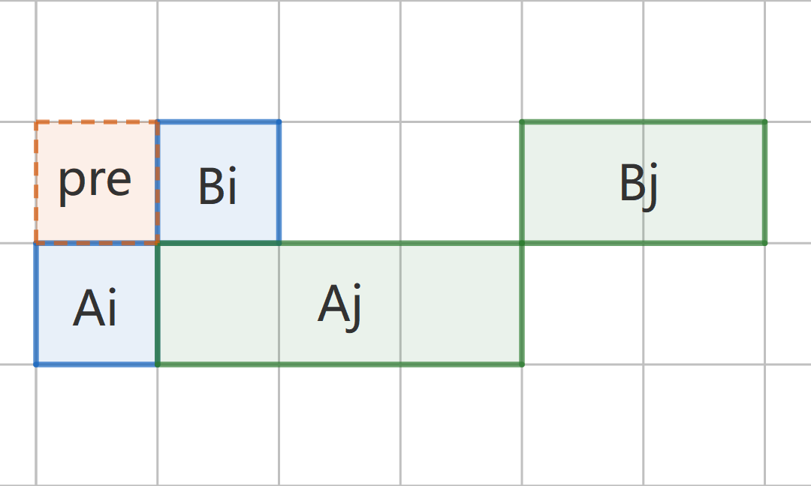
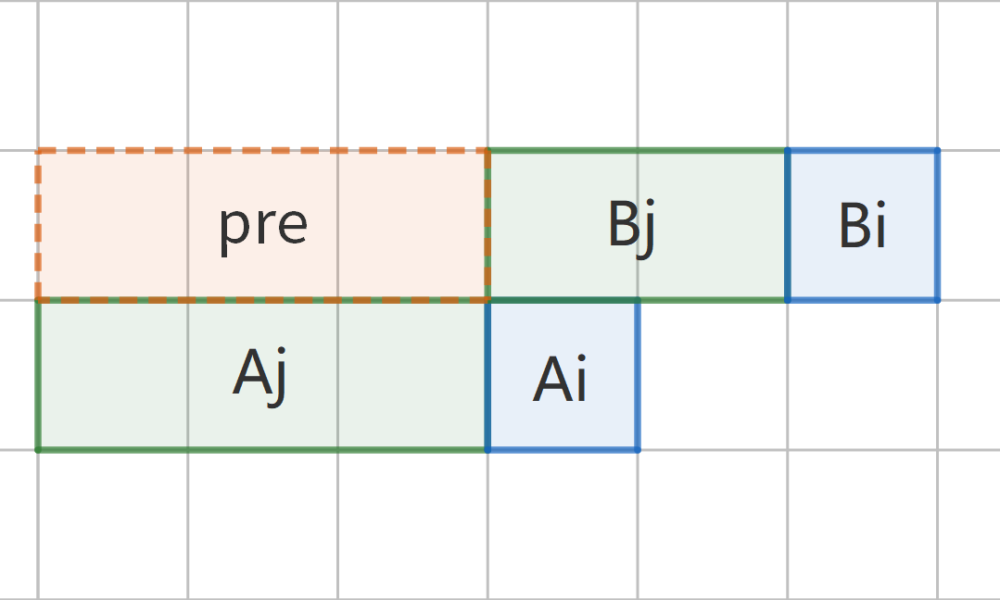

# P1248 加工生产调度

这是 Johnson（贪心）法则的一个典型应用（笔者觉得也算是例题）。

<ProblemInfoCard
  difficulty='purple'
  algorithms={['贪心','邻项交换排序','Johnson 法则']}
  date='2025-11-03~07'
  link='https://luogu.com.cn/problem/P1248'
/>

## 题意简述

现在有 $n$ 个产品，$A,B$ 两个车间。这些产品要先在 $A$ 车间依次完成加工，然后被送往 $B$ 车间。每个车间只能同一时间只能加工一个产品。这意味着如果一个产品在 $A$ 车间加工完后，$B$ 车间加工的上一个产品还没完成，则必须等待上一个产品在 $B$ 车间加工完成，然后当前产品才能送入 $B$ 车间加工。

现在已知每个产品在 $A$ 车间加工所需的时间 $A_i$，以及在 $B$ 车间加工所需的时间 $B_i$，求出加工这些产品所需的最短总时间，并求出此时的加工顺序。

范围：$1\le n\le10^3,\space1\le A_i,B_i\le10^3.$

## 思路 #1

考虑编号为 $i$，$j$ 的两个产品，它们先后被加工（即它们在加工顺序上紧邻）。

假设先加工 $i$，那么加工这两个产品总用时

$$
T_1=A_i+\max\{A_j,B_i\}+B_j.
$$

假设先加工 $j$，那么总用时

$$
T_2=A_j+\max\{A_i,B_j\}+B_i.
$$

**先加工 $i$ 总用时最短，当且仅当**

$$
\begin{aligned}
T_1&<T_2,\\
A_i+\max\{A_j,B_i\}+B_j&<A_j+\max\{A_i,B_j\}+B_i.
\end{aligned}
$$

让我们引入一个技巧：

> $\max\{A,B\}+\min\{A,B\}=A+B.$（显然）
> 
> 所以 $\max\{A,B\}=A+B-\min\{A,B\}.$

那么我们调整上式，即得：

$$
\begin{aligned}
A_i+(A_j+B_i-\min\{A_j,B_i\})+B_j&<A_j+(A_i+B_j-\min\{A_i+B_j\})+A_i,\\
\min\{A_i,B_j\}&<\min\{A_j,B_i\}.\tag{*}
\end{aligned}
$$

所以我们可以依据 $(\text{*})$ 式对所有产品排序，就能得到总加工时长最短的加工队列。

具体来说，我们用 `sort()` 排序即可。`bool operator<(another)` 返回 `true` 时 `*this` 排在 `another` 前面，所以我们这样重载小于号：

```cpp
bool operator<(const Product& another) {
    return min(a, another.b) < min(another.a, b);
}
```

> 请注意这样排序得到的序列并不是唯一的，这也是为什么这道题有 Special Judge 的原因。

按这样的思路，我们可以在洛谷上获得 $100pts$（Unaccepted），无法通过一组 Hack 数据（WA）：

<details>
<summary>Hack 数据</summary>

输入
```
7
6 1 7 1 1 1 6
3 1 3 1 6 1 10
```
输出
```
26
2 4 5 6 7 3 1 
```
输出（Ours）
```
33
5 1 2 3 4 6 7
```
</details>

## 思路 #1.5

为什么会出错呢？

有一点要提醒：当我们构造 `operator<()` 使用的条件时，应当满足**严格弱序**。（笔者有[一篇文章](../math/序理论)专门介绍了序理论）我们来仔细看看刚刚我们得到的 $(\text{*})$ 式：

$$
\min\{A_i,B_j\}<\min\{A_j,B_i\}.
$$

这个式子不满足严格弱序所要求的**不可比的传递性**。什么意思？对于两个数，如果 $A\not<B$ 且 $B\not<A$，则说明 $A,B$ **不可比**（在二元关系 $<$ 中）。本例中，$A,B$ 不可比 $\Leftrightarrow$ $\min\{A_i,B_j\}=\min\{A_j,B_i\}$。那不可比的传递性是什么意思？其实就是如果 $A,B$ 不可比，$B,C$ 不可比，那么 $A,C$ 也应该不可比。本例中，意思就是：

$$
\begin{aligned}
\min\{A_i,B_j\}&=\min\{A_j,B_i\},\\
\min\{B_i,C_j\}&=\min\{B_j,C_i\}\\
\Rightarrow\min\{A_i,C_j\}&=\min\{A_j,C_i\}.
\end{aligned}
$$

笔者觉得，到这里已经很明白了。譬如我们看式子左边，假如 $A_i<B_j$，$B_i<C_j$，我们并不能判断 $A_i<C_j$（注意下标）；再看右边，假如 $A_j<B_i$，$B_j<C_i$，并不能判断 $A_j<C_i$。更严谨地说，即使刚才这段话的所有条件同时成立，我们也不能推出第三行的结论。为了印证这一点，我们可以构造一个 Hack 数据：

$$
\begin{aligned}
\min\{10,20\}&=\min\{30,40\},\\
\min\{40,20\}&=\min\{20,114\}\\
\Rightarrow\min\{10,20\}&\not=\min\{30,114\}.\space\text{:(}
\end{aligned}
$$

那，我们怎么补救呢？我们只需特别处理一下 “不可比” 出现的情况，即 $\min\{A_i,B_j\}=\min\{A_j,B_i\}$ 的情况就好了。

## 思路 #2

$\min\{A_i,B_j\}=\min\{A_j,B_i\}$ 时，有 $T_1=T_2$，说明在只生产两个产品的情况下，如何排列 $i,j$ 对总时长没有影响。所以我们不妨考虑：如果 $i,j$ 之前有其他产品生产，会出现几种情况？

不妨设 $A_i=1,\space A_j=3,\space B_i=1,\space B_j=2$，如下图：

<div className='group'>
  
  

  $\text{Fig. 1}$ 先加工 $i$，$pre$ 较短
  </Img>
  
  

  $\text{Fig. 2}$ 先加工 $j$，$pre$ 较长
  </Img>
</div>

以 $\text{Fig. 1}$ 所示的情况为例。假设前一个加工的产品 $p$，其在 $B$ 车间完成加工的时间 $B_p<pre$，那么产品 $i$ 在 $A$ 车间完成加工后，立马可以送入 $B$ 车间。但如果 $B_p>pre$，我们就需要等待。因而我们安排 $i,j$ 的顺序时，$pre$ 更长一定是更优的，即我们要把在 $A$ 车间加工较久的产品放在前面。

这样就可以 AC 此题了（至少通过了洛谷上的数据）。

## 编码

<details>
<summary>用时 52 ms 内存 1020.00 KB</summary>
```cpp showLineNumbers
/*
* P1248 加工生产调度
*/
#include <bits/stdc++.h>
using namespace std;
const int MAXN = 1e3;
struct Product {
    int a, b, id;
    bool operator<(const Product& another) {
        int p = min(b, another.a);
        int q = min(a, another.b);
        if (p == q) return a > another.a;
        return p > q;
    }
} pro[MAXN];
int main() {
    int n;
    cin >> n;
    for (int i = 0; i < n; i++) cin >> pro[i].a;
    for (int i = 0; i < n; i++) cin >> pro[i].b;
    for (int i = 0; i < n; i++) pro[i].id = i + 1;
    sort(pro, pro + n);
    int facA = pro[0].a, facB = pro[0].a + pro[0].b;
    for (int i = 1; i < n; i++) {
        facB = max(facA + pro[i].a, facB) + pro[i].b;
        facA += pro[i].a;
    }
    cout << facB << '\n';
    for (int i = 0; i < n; i++) cout << pro[i].id << ' ';
    cout << '\n';
    return 0;
}
```
</details>

## 另请参阅

- [贪心#Johnson 法则](../贪心#johnson-法则)

## 参考

- [题解 P1248 【加工生产调度】](https://www.luogu.com.cn/article/108zf0wl)
- [浅谈邻项交换排序的应用以及需要注意的问题 - ouuan的博客](https://ouuan.github.io/post/%E6%B5%85%E8%B0%88%E9%82%BB%E9%A1%B9%E4%BA%A4%E6%8D%A2%E6%8E%92%E5%BA%8F%E7%9A%84%E5%BA%94%E7%94%A8%E4%BB%A5%E5%8F%8A%E9%9C%80%E8%A6%81%E6%B3%A8%E6%84%8F%E7%9A%84%E9%97%AE%E9%A2%98/)